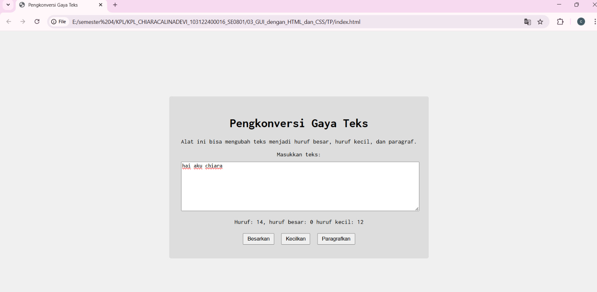

# Tugas Pendahuluan 03: GUI dengan HTML dan CSS

  **Nama** : Chiara Calina Devi  
  **NIM** : 103122400016  
  **Kelas** : SE-08-01  
  

**Soal**

Buatlah tata letak laman yang kamu buat berada di tengah seperti di bawah ini, dan juga ubah font-nya dengan Inconsolata 

**Kode sumber**

Tersedia di [index.html](index.html) [style.css](style.css) [script.js](script.js)

**Output**

**Deskripsi Program**

Program ini menciptakan sebuah tampilan laman untuk Pengonversi Gaya Text, dengan menggunakan html, css dan javascript.

