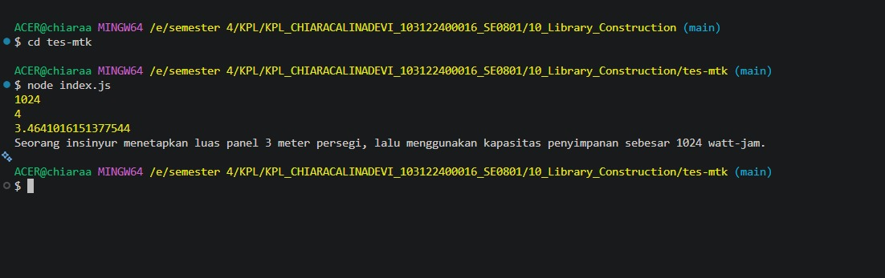

# TUGAS MANDIRI 10

## Library Construction

### Nama : Chiara Calina Devi

### NIM : 103122400016

### Kelas : SE-08-01

---

# Deskripsi Program

Program ini merupakan implementasi konsep **Library Construction** menggunakan JavaScript dan Node.js. Program memanfaatkan fungsi-fungsi yang telah dipisahkan ke dalam library untuk melakukan perhitungan terkait energi surya dan menghasilkan laporan secara otomatis.

Dengan pendekatan library, fungsi dapat digunakan kembali (reusable), lebih mudah dipelihara, dan lebih terorganisir dibandingkan menuliskan seluruh logika dalam satu file.

---

# Tujuan Praktikum

1. Memahami konsep Library Construction.
2. Menerapkan modular programming menggunakan ES Module.
3. Membuat fungsi yang dapat digunakan kembali.
4. Memisahkan logika bisnis dari program utama.
5. Meningkatkan maintainability dan readability kode.

---

# Struktur Project

```text
tes-mtk/
│
├── index.js
├── package.json
├── .gitignore
├── README.md
└── output.png
```

---

# Konsep Program

Program melakukan beberapa proses perhitungan:

1. Menghitung kapasitas penyimpanan energi.
2. Menghitung luas panel surya.
3. Menghasilkan nilai perhitungan tambahan.
4. Membuat laporan dalam bentuk kalimat otomatis.

Output program:

```text
1024
4
3.4641016151377544

Seorang insinyur menetapkan luas panel 3 meter persegi,
lalu menggunakan kapasitas penyimpanan sebesar
1024 watt-jam.
```

---

# Analisis Output

## 1. Kapasitas Penyimpanan Energi

Output:

```text
1024
```

Nilai ini menunjukkan kapasitas penyimpanan energi sebesar:

```text
1024 watt-jam (Wh)
```

yang digunakan dalam simulasi sistem energi surya.

---

## 2. Luas Panel

Output:

```text
4
```

Nilai ini menunjukkan hasil perhitungan luas panel surya.

Satuan:

```text
4 meter persegi (m²)
```

---

## 3. Nilai Perhitungan Tambahan

Output:

```text
3.4641016151377544
```

Nilai tersebut identik dengan:

```text
√12
```

karena:

```text
√12 = 3.4641016151377544
```

Perhitungan ini menunjukkan bahwa library juga memanfaatkan fungsi matematika untuk melakukan operasi akar kuadrat.

---

## 4. Laporan Otomatis

Output:

```text
Seorang insinyur menetapkan luas panel 3 meter persegi,
lalu menggunakan kapasitas penyimpanan sebesar
1024 watt-jam.
```

Program menghasilkan laporan otomatis berdasarkan data hasil perhitungan yang dilakukan sebelumnya.

---

# Alur Program

```text
Start
 │
 ▼
Input Parameter
 │
 ▼
Library Matematika
 │
 ├── Hitung Kapasitas
 │
 ├── Hitung Luas
 │
 └── Hitung Akar
 │
 ▼
Generate Laporan
 │
 ▼
Tampilkan Output
 │
 ▼
Selesai
```

---

# Cara Menjalankan Program

## 1. Masuk ke Folder Project

```bash
cd tes-mtk
```

---

## 2. Jalankan Program

```bash
node index.js
```

---

# Hasil Running

Perintah:

```bash
node index.js
```

Output:

```text
1024
4
3.4641016151377544

Seorang insinyur menetapkan luas panel 3 meter persegi,
lalu menggunakan kapasitas penyimpanan sebesar
1024 watt-jam.
```

---

## Screenshot Hasil Program

```markdown

```

---

# Konfigurasi Project

Project menggunakan konfigurasi ES Module pada file package.json sehingga dapat menggunakan sintaks:

```javascript
import ...
export ...
```

Konfigurasi tersebut ditentukan dengan properti:

```json
{
  "type": "module"
}
```

---

# Penggunaan .gitignore

Project menggunakan file `.gitignore` untuk menghindari file yang tidak perlu masuk ke repository seperti:

* node_modules
* file log
* cache
* environment file
* build output
* file temporary

Sehingga repository menjadi lebih bersih dan ringan.

---

# Analisis Clean Code

## 1. Modular Programming

Fungsi-fungsi matematika dipisahkan dari program utama sehingga lebih mudah digunakan kembali.

---

## 2. Reusability

Library dapat digunakan pada proyek lain yang membutuhkan perhitungan serupa.

---

## 3. Readability

Kode lebih mudah dipahami karena setiap fungsi memiliki tujuan yang jelas.

---

## 4. Maintainability

Jika terdapat perubahan rumus perhitungan, cukup mengubah library tanpa memodifikasi program utama.

---

## 5. Separation of Concerns

Logika perhitungan dipisahkan dari logika tampilan output.

---

# Kesimpulan

Praktikum ini berhasil menerapkan konsep Library Construction dengan memanfaatkan fungsi-fungsi yang dipisahkan ke dalam library. Program dapat melakukan perhitungan matematis dan menghasilkan laporan otomatis berdasarkan hasil perhitungan tersebut. Pendekatan modular ini meningkatkan keterbacaan, kemudahan pemeliharaan, serta memungkinkan kode digunakan kembali pada proyek lain sesuai prinsip konstruksi perangkat lunak modern.
