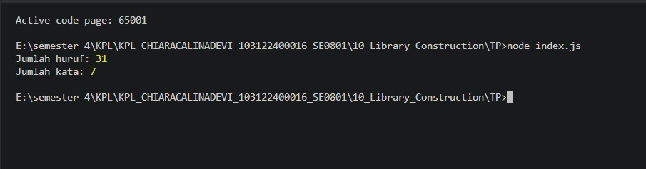

# TUGAS ENDAHULUAN 10
## Library Construction

### Nama : Chiara Calina Devi

### NIM : 103122400016

### Kelas : SE-08-01

---

# Deskripsi Program

Program ini merupakan implementasi sederhana dari konsep **Library Construction** pada JavaScript. Library yang dibuat digunakan untuk melakukan pengolahan string, khususnya menghitung jumlah huruf dan jumlah kata dalam suatu kalimat.

Library dipisahkan dari program utama sehingga dapat digunakan kembali (reusable) pada aplikasi lain tanpa harus menulis ulang kode yang sama.

---

# Tujuan Praktikum

1. Memahami konsep Library Construction.
2. Membuat fungsi yang dapat digunakan kembali (reusable).
3. Menerapkan modular programming menggunakan ES Module.
4. Memisahkan logika program dari aplikasi utama.
5. Menggunakan package.json untuk konfigurasi project Node.js.

---

# Struktur Project

```text
10_Library_Construction/
│
├── src/
│   └── stringUtils.js
│
├── index.js
├── package.json
├── .gitignore
├── README.md
└── output.png
```

---

# Source Code Program Utama

File: `index.js`

```javascript
import { hitungHuruf, hitungKata } from "./src/stringUtils.js";

const teks = "Hallo, ini tugas TP modul 10 nya ChiaraAa";

console.log("Jumlah huruf:", hitungHuruf(teks));
console.log("Jumlah kata:", hitungKata(teks));
```

Program utama mengimpor dua fungsi dari library:

* `hitungHuruf()`
* `hitungKata()`

Kemudian program memproses sebuah string dan menampilkan hasilnya ke terminal.

---

# Library yang Digunakan

File: `stringUtils.js`

Library ini berisi fungsi-fungsi yang berkaitan dengan manipulasi string.

## Fungsi hitungHuruf()

Fungsi ini digunakan untuk menghitung jumlah karakter huruf pada sebuah teks.

Contoh:

```javascript
hitungHuruf("Hallo")
```

Output:

```text
5
```

---

## Fungsi hitungKata()

Fungsi ini digunakan untuk menghitung jumlah kata dalam sebuah kalimat.

Contoh:

```javascript
hitungKata("Saya belajar JavaScript")
```

Output:

```text
3
```

---

# Analisis Program

Input yang digunakan:

```text
Hallo, ini tugas TP modul 10 nya ChiaraAa
```

### Hasil Perhitungan Huruf

Output:

```text
Jumlah huruf: 31
```

Artinya fungsi berhasil menghitung seluruh karakter huruf yang terdapat pada teks.

---

### Hasil Perhitungan Kata

Output:

```text
Jumlah kata: 7
```

Kata yang terdeteksi:

1. Hallo
2. ini
3. tugas
4. TP
5. modul
6. nya
7. ChiaraAa

Total = 7 kata.

---

# Alur Program

```text
Start
 │
 ▼
Input Teks
 │
 ▼
Import Library
 │
 ├── hitungHuruf()
 │
 └── hitungKata()
 │
 ▼
Proses Perhitungan
 │
 ▼
Tampilkan Hasil
 │
 ▼
Selesai
```

---

# Konfigurasi Package

Project menggunakan konfigurasi Node.js ES Module pada file package.json.

```json
{
  "type": "module"
}
```

Konfigurasi tersebut memungkinkan penggunaan:

```javascript
import ...
export ...
```

---

# Konfigurasi Git Ignore

Project juga menggunakan file `.gitignore` untuk mengabaikan file yang tidak perlu diunggah ke repository Git seperti:

* node_modules
* file log
* cache
* file environment
* file temporary
* build output

Hal ini membuat repository lebih bersih dan ringan.

---

# Cara Menjalankan Program

## 1. Pastikan Node.js Sudah Terinstall

Cek versi:

```bash
node -v
npm -v
```

---

## 2. Jalankan Program

```bash
node index.js
```

atau

```bash
npm start
```

Karena package.json telah menyediakan script start.

---

# Hasil Running Program

Perintah:

```bash
node index.js
```

Output:

```text
Jumlah huruf: 31
Jumlah kata: 7
```

---

## Screenshot Hasil Program

```markdown

```

---

# Analisis Clean Code

## 1. Modular Programming

Logika perhitungan dipisahkan ke dalam library sehingga kode lebih terorganisir.

---

## 2. Reusability

Fungsi `hitungHuruf()` dan `hitungKata()` dapat digunakan kembali pada proyek lain.

---

## 3. Readability

Nama fungsi mudah dipahami dan menjelaskan tujuan fungsi secara langsung.

```javascript
hitungHuruf()
hitungKata()
```

---

## 4. Maintainability

Jika terdapat perubahan pada cara menghitung huruf atau kata, cukup mengubah library tanpa memengaruhi program utama.

---

# Kesimpulan

Praktikum ini berhasil menerapkan konsep **Library Construction** dengan membuat library JavaScript untuk menghitung jumlah huruf dan jumlah kata pada sebuah teks. Dengan memanfaatkan ES Module, fungsi-fungsi dapat digunakan kembali pada berbagai proyek. Pendekatan ini meningkatkan modularitas, keterbacaan kode, serta kemudahan pemeliharaan sehingga sesuai dengan prinsip konstruksi perangkat lunak modern.
